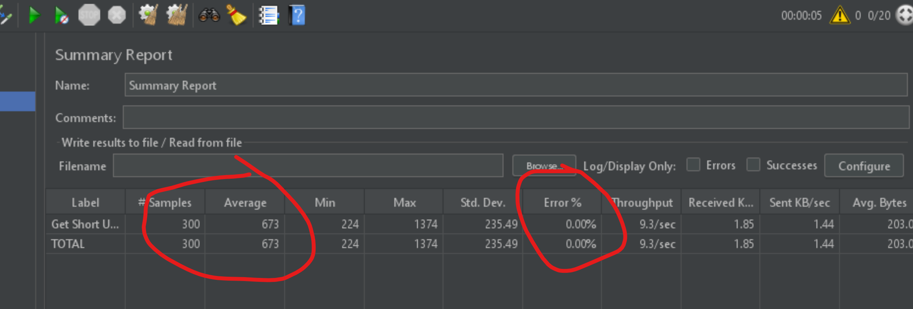

1st Oct 2022
------------
After the basic version, now I see that we need to update the cache when a new url key is generated. 
So this will involve setting key in cache when generating a url. 

So my redis is not setup correctly. It's calling the function but the key is just the same function name. 
It should be params also. 

Now I used cache.memoize so it's saving the key as argument also.

Now I need to know how to set key personnaly in redis. 

Now generateUrl is also setting cache but the key from memoize is different than the key we set. 

I replaced the @cache.memoize with setting and getting value. 
Now the value is being set with current key properly. 

The question comes is what if redis failed. 
There are 2 approaches, 
1. It should not fail. 
2. IF failed we shoudl have fallback. 


Created a basic docker image. It runs the sevrer but db is not setup. 
Next is to setup db and redis in the same network. 


29th Sep 2022
-------------
Today I implemented redis cache with the Flask_caching library. 
The setup was simple but it took some time to get the parts working. 

Now fetching of cached results is taking 10ms. 
I ran redis with docker so that I can set it up later with docker compose also. 

Adding redis also brings new type of problems like what if redis cache is down?
I checked with some problem and saw that application failed. 
So there should be a replica of redis also for availabilty. Or the app should be configured in such way that redis unavailability should not 
lead to app unavailability. 

```
docker container run --name db-redis -d  -p 6379:6379 redis
```
This was used to run redis. Later it will be used in docker compose. 

Good day for today. I think now I can think of working towards configuration of redis and working with 
docker to get the app running. 


28th Sep 2022
-------------
Now I am starting on redirection 
So basically when a request comes. check if the url exists and then redirect. 
Let's create a new route 
```
/redirect?key=12djk12
```

then check in db if key exists and redirect. 

Ok. Redirection is working now with fetching data from the Cassandra.


27th Sep 2022
--------------
Finally I was able to get some decent execution in the saving the data to cassandra node 
The trick was to use replication factor of 1. AS my machine can't handle 2 cassandra nodes. 




The times are now 500ms for 20 threads in parallel. 
I am sure this will improve if i have proper flask behind gunicorn. 


15th Sep 2022
----------------
Tried with execute_async but it's still taking time. 
Infact it's taking more. 

14th Sep 2022
-------------------
Cassandra is working now. 
Could not make it work with 2 or 4g of memory. 
Docker mahcines were crashing. 
Gave it free reign and it worked. 

Replication is working 

Throughput is back to 3-5 seconds. 
Now I need to think of how to put the database call in a new thread and return the response in flask. 
This will increase the throughput. 

For database calls the question is still how to save is persistenly. 
I can try to write to local file which is some append only file but how can many threads write to it. 
Need to read on how to do db calls to thread in flask. 

? Another thing is to make sure fake loadbalancer is working correctly with differnet ports 
check the github link from last entry

12th Sep 2022
-----------------
Now trying to learn cassandra from here 

Still unable to make it run. 
Docker using too much memory. 

I just wanted a simple solution. 

Adding db init scripts. 
change db code. 
updating docker-compose.yaml

11th Sep 2022
-------------

I am able to insert into the cassandra database but the insertion has increased the processing time and decreased the throughput. 
it's taking around 5 sec to process one request and this is causing issue. 


Now we should have fast insertion in the database and fast read also. 

I will mull over this problem later on how I can fast this up. 

Another problem I am noticing is my cassandra one of the servers is failing. 
Why is that ? 

Need to explore on that. 

Current problems : 
1. Cassandra taking long time to insert
2. One of nodes failing 
3. Attach redis.

Next issue is using redis cache. 


